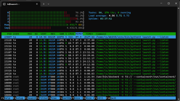
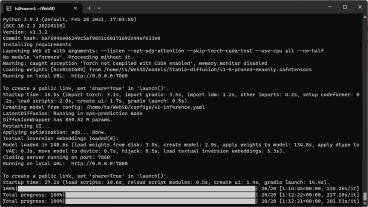
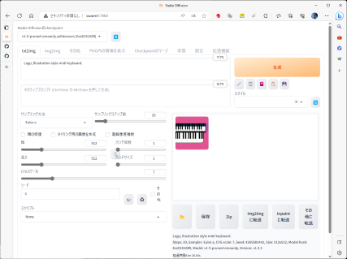

# AUTOMATIC1111 with RaspberryPi4
Raspberry Pi 4 で AUTOMATIC1111 を動かす

### ハードウェア
- Raspberry Pi 4B 8GB
- microSD Card 64GB
### ソフトウェア
- Raspberry Pi OS 64bit Lite
### スクリーンショット
 
CPUの4コアがフル活躍 
 
ちゃんと動いてる 
 
50分もかかった。

## [AUTOMATIC1111/stable-diffusion-webui](https://github.com/AUTOMATIC1111/stable-diffusion-webui)

### memory 確保
CPUのみで実行するには最低でもメモリが16GB以上必要らしい。
~~~diff
~ $ sudo nano /etc/dphys-swapfile
~~~
~~~diff
- CONF_SWAPSIZE=100
+ CONF_SWAPSIZE=8192
- #CONF_MAXSWAP=2048
+ CONF_MAXSWAP=8192
~~~
~~~sh
~ $ sudo systemctl restart dphys-swapfile
# モニタリング
~ $ htop
~~~
### Install on Linux without GPU

user name: user 
host name: host
~~~sh
user@host:~ $ sudo apt install wget git python3 python3-venv python3-pip libgl1-mesa-dev
user@host:~ $ sudo -H python3 -m pip install -U pip
user@host:~ $ git clone -b master https://github.com/AUTOMATIC1111/stable-diffusion-webui.git WebSD
user@host:~/WebSD $ python3 -m venv venv --upgrade-deps
user@host:~/WebSD $ . venv/bin/activate
# Pytorch のインストール（最新版になってる！）
(venv) user@host:~/WebSD $ pip install -U torch torchvision torchaudio
# その他のモジュールをアップデート
(venv) user@host:~/WebSD $ pip install -U psutil
(venv) user@host:~/WebSD $ pip install git+https://github.com/ethanfurman/aenum.git
# 設定: GPU無し, インストール済みのPytorch使用, xformers無し, accelerate無し
(venv) user@host:~/WebSD $ nano webui-user.sh
~~~
[webui-user.sh](src/webui-user.sh)
~~~sh
# install and run
user@host:~/WebSD $ bash webui.sh
~~~
> http://host:7860
